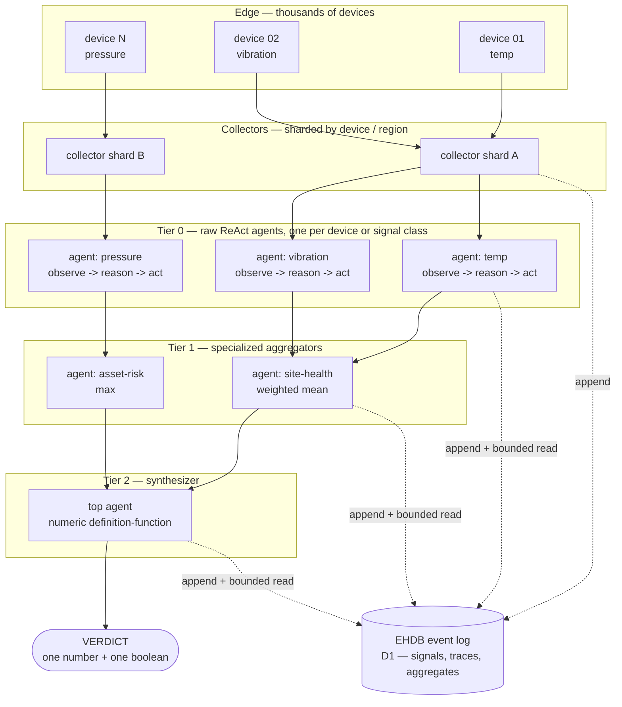
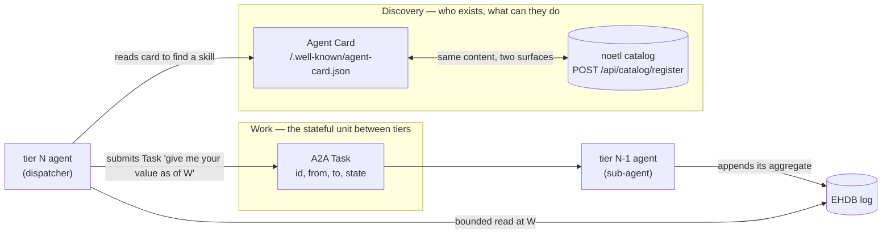
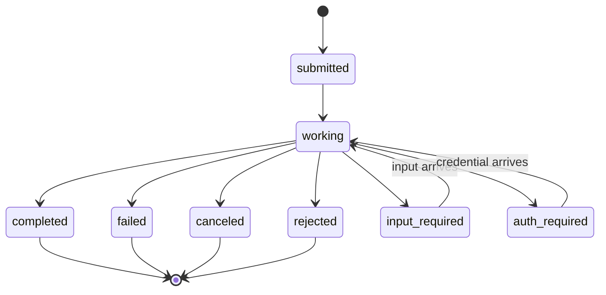
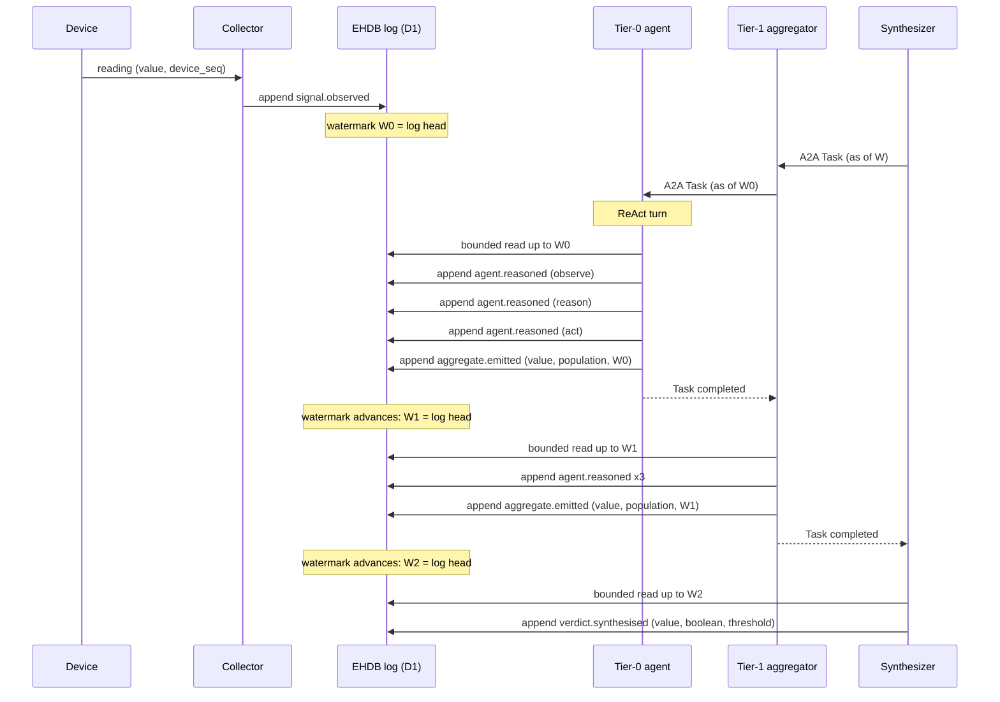

# A2A Signal Mesh — architecture blueprint

**Audience:** the team. You should be able to read this and understand the whole
architecture without opening a single source file.

**This document is the reference.** The implementation/proof spec is
[`docs/spec/a2a-react-signal-mesh.md`](../spec/a2a-react-signal-mesh.md) — it
carries the POC, the file:line grounding, and the evidence. Where the two
disagree, the spec is the one that was checked against code.

---

## 1. The problem in one paragraph

Thousands of devices emit thousands of signals. No single model can reason over
all of them, and no single number is meaningful without knowing how it was
reached. So we build a **hierarchy of small reasoners**: each one looks at a
narrow slice, decides something, and publishes a reduced value for the tier
above. The top of the hierarchy emits **one number and one boolean** — a
numerical definition-function of everything reasoned below it. Every step is an
event, so the answer can be replayed and audited rather than trusted.

---

## 2. The topology

**Read the dotted lines as the real data path.** The solid arrows show logical
flow, but no tier calls another tier for *data* — every tier **appends to the
log and reads from the log**. A2A Tasks (§4) carry the *request*; the log
carries the *answer*. That separation is what makes the whole thing replayable.

---

## 3. Component responsibilities

| Component | Owns | Explicitly does NOT own |
| :-- | :-- | :-- |
| **Device** | Producing a reading | Any notion of tiers, agents or thresholds |
| **Collector** | Ingest, shard assignment, backpressure, appending `signal.observed` | Interpretation. A collector never reasons |
| **Tier-0 agent** | Local reasoning over ONE device or signal class; emitting a reduced value + its population weight | Cross-class correlation |
| **Aggregator tier** | Reducing its children's aggregates; nothing else | Reading raw signals. An aggregator that touches raw signals has skipped a tier and broken the weights |
| **Synthesizer** | The final reduction, the threshold, and the boolean | Reasoning about individual devices |
| **EHDB (D1)** | The event log: signals, reasoning traces, aggregates, verdicts | Deciding anything |
| **Knowledge base (D6 vector)** | Platform context an agent can retrieve | User documents — see §8 |
| **noetl playbooks** | Orchestration, fan-out, special-case handling | The steady-state cascade, which is event-driven |

The single most important rule in this table: **each tier reduces only the tier
directly below it.** Skipping a tier silently corrupts the population weights,
and the result looks entirely reasonable (§7).

---

## 4. Where A2A fits

A2A is how agents **find each other and ask each other for work**. It is not how
the data travels.

**Agent Card = capability registration.** A JSON document declaring identity,
skills, endpoint and auth. Served at **`/.well-known/agent-card.json`** (RFC
8615). In our mesh it is registered in the **noetl catalog**, and the well-known
path is a projection of that entry — one source of truth, two surfaces.

**Task = the stateful unit moving between tiers.** A tier-N agent submits a Task
to a tier-(N-1) agent meaning *"produce your value as of watermark W"*.

A2A defines **eight** task states:

⚠ **`input-required` and `auth-required` are interrupted, not terminal.** They
resume. Treating them as failures is the most common way a dispatcher
mis-implements A2A, and it turns a recoverable pause into a lost branch of the
cascade. Terminal states are exactly four: `completed`, `failed`, `canceled`,
`rejected`.

Protocol version in use: **A2A 1.0.0**. Version negotiation uses `Major.Minor`;
the patch number is excluded.

---

## 5. The cascade on a single signal

⚠⚠ **The watermark advances per tier, and it must.** A single global watermark
for the whole cascade is the obvious design and it is wrong: tier-0 emits its
aggregates at sequences *above* the entry watermark, so every tier above reads a
prefix that structurally cannot contain them — and reduces zero inputs to `0.0`,
confidently, with no error anywhere. Each tier therefore reads at the log head
**as of the moment the tier below finished**, and records that watermark on its
aggregate.

Determinism survives because the watermark is **named**, not "latest". Within a
tier, all agents share one watermark, so siblings cannot see each other's output
and the tier is order-independent.

---

## 6. Determinism and replay

Three properties, and each one is load-bearing:

1. **Everything is an event.** Not just the signals — the *reasoning traces* and
   the *aggregates* too. This is the difference between replaying a decision and
   merely having logged it.
2. **Context is a pure fold.** An agent's working context is
   `fold(events, up_to_seq)` — a pure function. No clock, no I/O, no
   hash-ordered output. Each of those would let the same input produce a
   different context.
3. **Cross-tier reads are bounded.** A tier never asks for "latest". It names a
   watermark, and the fold reports how far behind that watermark it actually
   got.

⚠ **Staleness is reported, never hidden.** An agent that cannot distinguish "I
read everything" from "I read what happened to exist" will publish a confident
aggregate over a partial prefix. The fold returns the gap between the requested
watermark and what it folded, and policy decides whether that gap is acceptable.

Freshness policy reuses the platform's existing vocabulary rather than inventing
one: `ReadConsistency` is `strong` / `bounded` / `exact`, with
`NOETL_EHDB_READ_CONSISTENCY` and `NOETL_EHDB_MAX_STALENESS_MS` as the knobs.

**Forward compatibility is a hard requirement, not a nicety.** A tier mesh is
upgraded tier by tier, so a lower tier *will* emit event kinds an upper tier does
not recognise yet. Unknown kinds must fold as "unknown" and still advance the
watermark. A fold that refuses them turns a rolling upgrade into an outage.

---

## 7. Scalability — thousands × thousands

| Concern | Approach |
| :-- | :-- |
| **Fan-out** | Agents are materialised at runtime by playbook fan-out over a computed list. The number of children is never fixed at authoring time |
| **Sharding** | Collectors shard by device/region; a tier-0 agent is pinned to the shard owning its devices, so its fold is engine-local |
| **Statelessness** | An agent holds **no durable state**. Its entire context is derivable from the log by folding. Any node can run any agent; a restarted agent re-folds and continues |
| **Upward bandwidth** | A tier passes `(value, population, watermark)` — **not** its inputs. Upward traffic is O(agents), not O(signals) |
| **Read cost** | ⚠ **The real constraint.** A fold is O(prefix). If every agent folds one shared log, total work is quadratic in agents. Production needs per-agent streams or an indexed prefix so each agent folds only its own slice |
| **Backpressure** | Bound the **collector**, not the agents. A dropped signal must be visible as a gap, never as a silently smaller denominator |

### The weighting trap

The most dangerous scaling bug is arithmetic, not infrastructure:

> A tier must pass the **summed population** it reduced — not the number of
> children it has.

Pass the child count and a weighted mean silently becomes a plain mean of means,
one tier up. **The error is invisible whenever the populations happen to be
equal** — which is exactly what a tidy test fixture makes them. Any test for
this must use deliberately uneven populations, or it will pass against the bug.

---

## 8. Safety and gates

| Gate | Rule |
| :-- | :-- |
| **Knowledge base scope** | The D6 vector tier carries **platform context only**. User documents are not ingested |
| **Generated steps** | Special-case handling may *propose* steps. Proposals are validated and counted; **generated code is not executed** |
| **Authoritative store** | Postgres remains authoritative and is never written by the mesh. The mesh appends to the event log only |
| **Arming** | Every capability is flag-gated and off by default. Only the exact string `"true"` arms a flag |
| **Card trust** | An Agent Card with no declared security scheme is not publishable outside the cluster |
| **Determinism** | The default reasoner is deterministic. A model-backed reasoner is flag-gated, and no test asserts on the model path |

The pattern throughout is **shadow first, enforce deliberately**: a new check is
introduced counting and reporting, and promoted to refusing as a separate,
reversible step.

---

## 9. What exists today vs what is new

```mermaid
flowchart LR
    subgraph HAVE["Already in the tree"]
        H1["D1 event log<br/>append-only, sequenced"]
        H2["Pure fold + canonical digest"]
        H3["ReadConsistency<br/>strong/bounded/exact"]
        H4["D6 vector tier"]
        H5["noetl catalog register"]
        H6["playbook fan-out over<br/>a runtime value"]
        H7["runtime-chosen model<br/>via mcp tool"]
        H8["sharding + placement<br/>+ membership"]
    end
    subgraph NEW["New for the mesh"]
        N1["mesh event kinds<br/>signal / reasoned / aggregate / verdict"]
        N2["tier reduction +<br/>population weighting"]
        N3["per-tier watermark<br/>cascade"]
        N4["Agent Card to catalog<br/>projection"]
        N5["A2A Task transport"]
        N6["per-agent stream<br/>partitioning"]
    end
    HAVE --> NEW
```

**Reused, not rebuilt:** the event log, the fold contract, the read-consistency
vocabulary, the catalog as a registration carrier, playbook fan-out, and the
sharding/placement primitives. The mesh is mostly *composition*.

**Genuinely new:** the mesh event kinds, the tier reduction with population
weighting, the per-tier watermark cascade, the Agent-Card↔catalog projection,
real A2A transport, and per-agent stream partitioning.

---

## 10. Scope and non-goals

### This blueprint commits to

- Tiered reduction where each tier reads only the tier below, at a named watermark.
- Every signal, reasoning trace, aggregate and verdict being an event.
- Agent context as a pure fold; agents holding no durable state.
- A2A for discovery (Agent Card) and for inter-tier work (Task).
- Postgres untouched; the knowledge base scoped to platform context.
- Flag-gated, shadow-first rollout.

### This blueprint does NOT commit to

- **A transport choice.** JSON-RPC, gRPC and HTTP+JSON are all valid A2A
  bindings. Not decided here.
- **A specific reasoner.** Whether a tier uses arithmetic, a small local model,
  or a hosted one is per-tier configuration.
- **Dynamic child-playbook selection.** Selecting a child playbook by a
  runtime-computed path is **not demonstrated anywhere in the tree today**.
  Treat it as an open question, not a capability.
- **A storage layout for per-agent streams.** §7 names the constraint; it does
  not pick the solution.
- **Cross-region behaviour.** The multi-region work is a separate track.

### Carried over from the POC — what has NOT been proven

The proof-of-concept demonstrates the cascade and its replayability. It does
**not** demonstrate:

1. **Durability** — the POC's log is in-memory.
2. **Real A2A transport** — Agent Cards and Tasks are the data model only; no
   HTTP, no auth, no third-party interop.
3. **Scale** — 6 devices and 4 agents. The O(prefix) problem in §7 is described,
   not solved or measured.
4. **Model quality** — the default reasoner is arithmetic.
5. **Concurrency** — the cascade is single-threaded; ordering, contention and
   partial failure between tiers are untested.
6. **EHDB integration** — the POC mirrors the event/fold contract; it does not
   call the engine.
7. **Playbook execution** — the orchestration mapping is a design claim.
8. **Backpressure or failure injection** — every append succeeds.

⚠ Read that list before quoting this blueprint as evidence. The architecture is
argued; most of it is not yet demonstrated at scale.

---

## 11. Glossary

| Term | Meaning |
| :-- | :-- |
| **Tier** | A horizontal layer of agents that all reduce the same kind of input |
| **Watermark** | A named sequence bound. "As of here", never "latest" |
| **Fold** | The pure function from an event prefix to an agent's working context |
| **Population** | How many original signals a value ultimately summarises. Travels upward with every aggregate |
| **Staleness** | Requested watermark minus what was actually folded |
| **Agent Card** | A2A capability advertisement |
| **Task** | A2A stateful unit of work between two agents |
| **Verdict** | The top tier's output: one number, one boolean |

## 12. Related

- [`docs/spec/a2a-react-signal-mesh.md`](../spec/a2a-react-signal-mesh.md) — the
  implementation spec, POC and evidence
- ReAct — Yao et al., arXiv:2210.03629 (ICLR 2023)
- HAMMR — Castrejon et al., arXiv:2404.05465 (NeurIPS 2024 Workshop): a
  dispatcher ReAct agent whose actions are themselves ReAct agents
- A2A specification — <https://a2a-protocol.org/latest/specification/>
