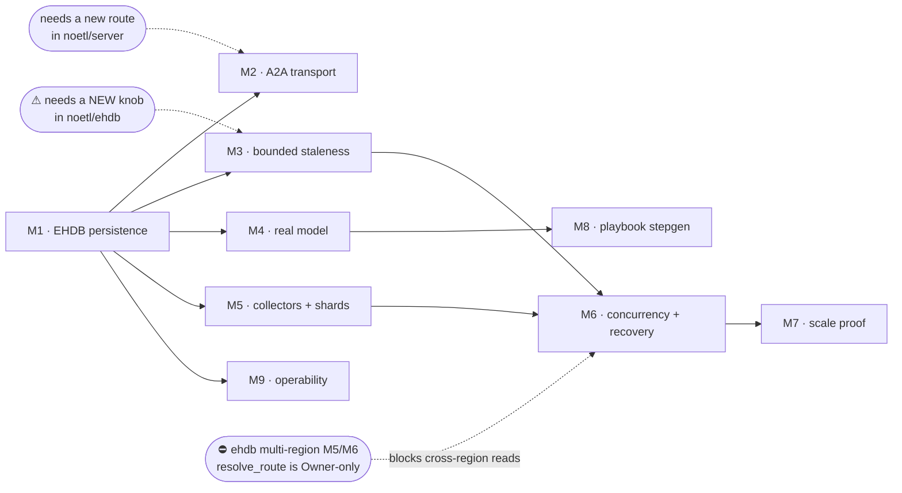

# signal-mesh — production implementation scope

**Status:** plan / scope. **Nothing here is built, deployed, or enabled.**
**Audience:** the team, and whoever picks up M1.

This turns the POC into a deployable component. It is written against code that
exists today: every load-bearing claim below is marked **VERIFIED** with a
`file:line`, or **ASSUMED** with what would settle it. Two of the POC's own
documents make a claim that does not survive that check; §2.3 corrects them.

| | |
| :-- | :-- |
| What exists | [`docs/spec/a2a-react-signal-mesh.md`](spec/a2a-react-signal-mesh.md) (proof spec), [`docs/architecture/a2a-signal-mesh-blueprint.md`](architecture/a2a-signal-mesh-blueprint.md) (blueprint), this crate |
| What this adds | the path from "argued" to "running", as flag-gated milestones |
| Discipline | every milestone default-off, kind before prod, RED→GREEN with a discriminating control, and a printed denominator |

---

## 1. The shape of the problem

The POC proves a cascade and its replayability over an **in-memory** log
(`src/mesh.rs:8` — *"An in-memory stand-in for EHDB's D1 event log"*). Spec §11
lists eight things it does not prove. This plan turns each of those into a
milestone with a flag, an entry and exit condition, a blast radius, and a
rollback.

The central design claim is unchanged and is what makes the rest tractable:
**no tier calls another tier for data.** A2A Tasks carry the request; the log
carries the answer. Every milestone below preserves that.

---

## 2. Grounding

### 2.1 VERIFIED — what already exists and must be reused, not rebuilt

All paths are in [`noetl/ehdb`](https://github.com/noetl/ehdb) at `main`
(`273452e`) unless marked otherwise. Tags `v0.3.0` and `v0.3.1` both carry
`ehdb-l0` and `ehdb-slm-context`.

**The event log and its engine**

| Claim | Evidence |
| :-- | :-- |
| `L0Engine<D: Dataset>`, opened per dataset | `crates/ehdb-l0/src/engine.rs:313,357` |
| D1 is a real dataset id | `crates/ehdb-l0/src/dataset.rs:156` — `DATASET_D1_EVENT_LOG = "d1_event_log"` (all ten D1–D10 exist) |
| `EventRecord { global_sequence, execution_id, transaction_id, payload: String, event_id: Option<String>, commit_hlc: Option<u64> }` | `crates/ehdb-l0/src/dataset.rs` |
| **Idempotency is a first-class column**, deduped at append under the engine lock | `dataset.rs` (`event_id`), `engine.rs:746` |
| `append_record_reporting -> (u64, bool)`; `false` = *already present*, position is the existing record's | `engine.rs:728` |
| **Bounded, index-pruned prefix read**: `read_index_after(index_value, after_seq) -> Vec<Record>` | `engine.rs:1380` |
| Partition-scoped reads, incl. a limited form | `engine.rs:1481,1511` |
| `Dataset` trait fixes `sort_key`, `partition`, `index_key`, `read_partition`, **and an idempotency key** | `crates/ehdb-l0/src/dataset.rs` |
| Sharding primitive | `dataset.rs:269` `shard_for_execution`, `engine.rs:1592` `L0Engine::shard_for` |
| **Group-commit batch append** | `crates/ehdb-feed/src/lib.rs:434,461` — `append_batch_reporting -> Vec<(u64,bool)>` |
| Engine defaults | `dataset.rs:161` `DEFAULT_SHARD_COUNT = 1`; `engine.rs:51,53,55,68` granule 16, seal 1024 records / 8 MiB, manifest retain 32 |
| L0 frame ceiling is **64 MiB** | `crates/ehdb-l0/src/frame.rs:25` `MAX_FRAME_BODY_BYTES` |
| ⚠ The **worker's** event-log client caps a payload at **1 MiB** | `noetl/worker` `src/ehdb/eventlog.rs:72` `MAX_PAYLOAD_BYTES_CEILING = 1_048_576` |

⭐ **`read_index_after` is the thing blueprint §7 said production would need.**
§7 names the O(prefix) fold as "the real constraint" and says production needs
"per-agent streams or an indexed prefix". The indexed prefix exists: `index_key`
drives per-part and per-granule blooms, and `read_partition` prunes the read to
one partition. The mesh does not need to invent per-agent storage — it needs to
**choose its `index_key`**.

**Consistency and freshness**

| Claim | Evidence |
| :-- | :-- |
| `ReadConsistency::{Strong, Bounded{max_staleness_millis}, Exact{at_millis}}` | `crates/ehdb-core/src/plan.rs:178` |
|  `resolve_visibility(cfg, now_millis) -> VisibilityPlan` — pure; **the clock is injected** | `plan.rs:377` |
| Closed timestamps: `ClosedTimestamp`, `closed_timestamp_for`, `FreshnessRefusal`, `admits` | `crates/ehdb-l0/src/closed_timestamp.rs:53,84,94,159` |
| `commit_hlc` is **write-only on purpose** — "Nothing reads this, and that is the phase's exit criterion, not a gap" | `dataset.rs` |

**Multi-region / placement (M0-series)**

| Claim | Evidence |
| :-- | :-- |
| `placement::locality_from_env` | `crates/ehdb-l0/src/placement.rs:52` |
| `membership::{MembershipMode, MembershipPolicy, MembershipView, view_for}` | `crates/ehdb-l0/src/membership.rs:38,157,228,249` |
| `region_routing::{read_locality_from_env, resolve_route, RouteRefusal}` | `crates/ehdb-l0/src/region_routing.rs:38,89` |
| `failure_domain::{check_replica_domains, survives_node_loss}` | `crates/ehdb-l0/src/failure_domain.rs:157,222` |
| `write_failover::{FailoverMode, activate}` | `crates/ehdb-l0/src/write_failover.rs:31,90` |

**The SLM path (S0–S3)**

| Claim | Evidence |
| :-- | :-- |
| `fold(execution_id, events: &[(u64, Vec<u8>)], up_to_seq, version, budget) -> Result<WorkingContext, FoldError>` | `crates/ehdb-slm-context/src/fold.rs:181` |
| `WorkingContext::canonical_bytes()` — the digest basis | `fold.rs:171` |
| A **`Budget`** with `BudgetLimit` and `is_exhausted()` | `fold.rs:83,92,132` |
| S3 gate is **propose-only**, and there is *no execution path in the crate at all* | `crates/ehdb-slm-context/src/gate.rs:1-15,284,542` |
| Seven ordered gates: malformed → budget → **injected** schema → credential reach → deny list → read-shape → allowlist + human gate | `gate.rs:17-32` |
| ⛔ `python` is **denied**, checked before the allowlist and before the human gate — owner decision 2026-09-19 | `gate.rs:36,210,213` |
| ⛔ `http` is off the default allowlist **because the URL is not mechanically checkable** | `gate.rs:41-45` |
| The crate **never validates DSL itself** — a `DslValidator` is injected | `gate.rs:23-28` |
| SLM flags: `NOETL_SLM_STEPGEN`, `_HUMAN_GATE`, `_ALLOWED_TOOL_KINDS`, `_DENIED_TOOL_KINDS`, `_HTTP_ALLOWED_HOSTS`, `_ALLOWED_KEYCHAIN_ALIASES`, `_CATALOG_PREFIX` | `gate.rs:98,226,235,244,253,256,265` |

**The noetl DSL surface**

| Claim | Evidence |
| :-- | :-- |
| Catalog registration endpoints | `noetl/server` `src/main.rs:89,91` — `/api/catalog/register`, `/register/batch` |
| The DSL validator the S3 gate wants injected is `pub` | `noetl/server` `src/playbook/parser.rs:15,164` |
| `mcp` and `playbook` are registered tool kinds (so is `python`, which the gate denies) | `noetl/tools` `src/registry.rs:391-406` |
| The runtime-chosen-model pattern, with a Gemma pin | `noetl/ops` `automation/agents/troubleshoot/diagnose_execution.yaml:75` (`triage_model: "gemma3:4b"`), `:301` (`kind: mcp`) |
| Runtime fan-out over a step result | `noetl/noetl` `tests/fixtures/playbooks/batch_execution/heavy_payload_pipeline_in_step/…:125` (carried from spec §2) |
| Body limit on the server is 64 MiB | `noetl/server` `src/main.rs:527,681` |

### 2.2 VERIFIED absent — genuinely new work

- **No `/.well-known/` route exists on the noetl server.** The only hits are
  Auth0's JWKS URL being *constructed* (`repos/server/src/handlers/auth_verify.rs:38,419`).
  Serving an Agent Card is new code, not a re-route.
- **No batch append on `L0Engine` itself** — the group-commit batch lives in
  `ehdb-feed` (`src/lib.rs:434,461`). Which one the collector uses is fork F-2.
- **No A2A transport anywhere in the fleet.** `a2a.rs` in this crate is a data
  model: `AgentCard`, eight `TaskState`s, `fnv1a_hex`, `canonical_json`.

### 2.3 ⚠⚠ CORRECTION — two documents in this repo assert a flag pair that does not exist

Blueprint §6 and spec §9 both present **`NOETL_EHDB_READ_CONSISTENCY`** and
**`NOETL_EHDB_MAX_STALENESS_MS`** as *"M3's flags, reused"*, with spec §9 adding
*"a second name for one concept is a second thing to keep true."*

**Neither string occurs anywhere in `noetl/ehdb` — any crate, any file type —
nor in `noetl/server`.** Denominator: two `grep -rn` sweeps over the full
working trees of both repos, not limited to `*.rs`; zero hits in each.

What actually exists is the **type** and the **resolvers**: `ReadConsistency`
(`plan.rs:178`), `resolve_visibility` (`plan.rs:377`), `admits`
(`closed_timestamp.rs:159`). Nothing reads configuration into them. The spec is
narrowly right that *the POC consumes the type and does not read the env vars* —
but both documents imply a configured platform knob on the other side of that
sentence, and there isn't one.

This matters twice over:

1. **M3 below cannot "reuse the platform's knob" — it has to introduce it**,
   and introducing it is a change to EHDB or the server, not to this repo. That
   moves a dependency from *"already there"* to *"needs a PR in ehdb"*.
2. It is the same class the fleet keeps finding: **a type that exists is not a
   path that runs.** `resolve_route` makes the point itself — it always returns
   `RouteTarget::Owner`, with the comment *"Target selection among replicas is
   M6's job and is gated behind M5"* (`plan.rs:359`). The routing type is real;
   the routing is not.

**Action:** M3 owns naming and wiring the knob, in ehdb, once, under the
existing `NOETL_EHDB_*` prefix. This repo consumes it and never defines a
second one. The blueprint and spec get a one-line correction in the same change
set as M3 — not before, so the documents do not claim a knob that still doesn't
exist.

### 2.4 ASSUMED — stated so it can be checked, not relied on

| Assumption | What would settle it |
| :-- | :-- |
| An `L0Engine` opened by a non-server process can share D1 with the server | Read `engine.rs` open/lock semantics + a two-process kind test. **Blocks M1.** |
| Gemma is reachable from a worker in prod via `kind: mcp` at the pin in `diagnose_execution.yaml` | One `kind: mcp` call from a kind worker, recorded |
| The `DslValidator` in `noetl/server` can be linked from a mesh process, or must be called over HTTP | Read the crate boundary; if HTTP, M6 gains a hop |
| Device signal volume shape (rate, burstiness, payload size) | **Nobody has stated a real workload.** §7's targets are therefore *design* targets, and are labelled as such |

---

## 2.5 ⭐ External review, 2026-09-24 (Nick / cybx) — verified against the code

An external review against the original requirements found six gaps. **All six
are confirmed**, one is worse than reported, and one is partially addressed. The
top two are the *core* requirement and re-order the roadmap: they come before
the remaining read-side M-series work.

| # | review's claim | verdict | evidence |
| :-- | :-- | :-- | :-- |
| 1 | The cascade is **top-initiated**, so this is periodic scoring, not escalation | ✅ **CONFIRMED** | `mesh.rs:229` `Task::submit(&task_id, "dispatcher", &id, …)` — a synthetic dispatcher submits *downward* to every agent; blueprint §5 shows `TOP->>T1` / `T1->>T0`. Nothing is triggered from below. |
| 2 | **No correlation tier** — siblings invisible, aggregators see only direct children, tier 0 is single-class | ✅ **CONFIRMED** | `mesh.rs:257` `ctx.inputs.retain(\|i\| children.contains(&i.agent_id))`; `:258` `ctx.signals.clear()`; `:266` tier-0 filters to one `signal_class`. Network + endpoint + identity cannot combine. |
| 3 | **Per-agent streams not built** — the quadratic shared-log problem | ⚠️ **PARTLY ADDRESSED** | The *mechanism* exists — fork F-1 made `index_key` the stream (`store.rs`), and `read_index_after` prunes to one partition. The *partitioning* does not: `serve.rs:114,154` open a single hardcoded stream `"mesh-1"`, so every agent still folds one shared log. Mechanism real, benefit unrealised. |
| 4 | Reasoner is **scripted arithmetic** | ✅ **CONFIRMED** | `react.rs:56,64` — `Reasoner` has exactly one impl, `DeterministicReasoner`. |
| 5 | **No failure semantics** for a missing child | ✅ **CONFIRMED, and worse than reported** | See below. |
| 6 | No **cyber** worked example | ✅ **CONFIRMED** | Only temp/vibration/pressure. The `security` hits in the tree are `securitySchemes` on the Agent Card — a different sense of the word. |

### ⚠⚠ #5 is the sharpest finding: the document states the rule, the code breaks it

Blueprint §7 says plainly: *"a dropped signal must be visible as a **gap**, never
as a silently smaller denominator."* `fold.rs` does the opposite:

```rust
pub fn population(ctx: &TierContext) -> u32 {
    if !ctx.inputs.is_empty() {
        return ctx.inputs.iter().map(|i| i.input_count).sum();   // present inputs ONLY
    }
    ctx.signals.len() as u32
}
```

A child that never emitted is simply **absent** from `ctx.inputs`. The weighted
mean is then computed over the survivors and the denominator shrinks silently —
a confident, well-formed, entirely wrong number, with no error anywhere. This is
the project's own recurring failure class (*absent is not zero*) sitting in its
own arithmetic, and it is exactly the shape the POC's `weighted_mean_respects_
population_not_child_count` test was written to catch one level up.

⭐ **Reference implementation:** the review notes that the **SRE incident-triage
demo** already exhibits the event-driven + correlating pattern this mesh lacks.
It is the closest working example of the target shape and should be read before
designing M10/M11 rather than after.

### Re-prioritised roadmap

The two core gaps become **M10** and **M11** and run *before* the remaining
read-side work. The M-series is renumbered by priority, not by invention date:

| order | milestone | status |
| :-- | :-- | :-- |
| 1 | **M10 — event-driven escalation** | ⭐ NEW. The #1 gap. |
| 2 | **M11 — correlation tier** | ⭐ NEW. The #2 gap. |
| 3 | **M12 — failure semantics** | ⭐ NEW (review #5). Small, and it protects every number above it, so it lands early. |
| 4 | M3 — bounded-staleness reads | ehdb side **done** ([noetl/ehdb#368](https://github.com/noetl/ehdb/pull/368)); consuming half open |
| 5 | M5 — per-agent streams + collectors | review #3: finish the partitioning the mechanism already supports |
| 6 | M4 — model-backed reasoner | review #4, via the ops#311 backend |
| 7 | M7 — scale proof, with the numbers in §7.1 | review #3 |
| 8 | M6, M8 | unchanged |

---

### M10 — Event-driven escalation ⭐ NEW

**The gap.** A tier-0 agent cannot say anything until it is asked. That makes
the mesh a *periodic scorer*; the requirement is *"escalate the moment a device
starts beaconing to C2."*

**Design.** Escalation is **additive** — the scheduled cascade is untouched and
remains the correctness baseline. A tier-0 agent that crosses a severity
threshold **pushes** a Task upward on its own.

- **Trigger:** a per-agent `severity` predicate over the reduced value —
  threshold crossing, or rate-of-change over a window (log-growth). Evaluated
  at `act`, where the value already exists.
- **Transport:** A2A push. The card already advertises
  `capabilities.pushNotifications: true`, which is currently a **claim with no
  implementation** — M10 makes it true or must stop advertising it.
- **Dedupe:** an escalation carries the `(agent, watermark, severity_band)` it
  fired for. The same band at the same watermark escalates **once**. ⚠ Without
  this a beaconing device escalates on every append forever.
- **Backpressure:** bound the *escalation path*, never the ingest — a dropped
  escalation must be a counted gap, not a smaller denominator. Same rule as the
  collector.

**Acceptance.** A tier-0 signal above threshold produces an upward Task **with
no cascade call**; below threshold produces none (the discriminating control);
the same band at the same watermark fires once; a suppressed escalation is
counted; and the scheduled cascade still yields the pinned `52.5000`.

**Flag** `NOETL_SIGNAL_MESH_ESCALATION` (off). **Blast radius:** additive path,
off by default. **Rollback:** unset.

### M11 — Correlation tier ⭐ NEW

**The gap.** `retain(children.contains(…))` means an aggregator sees only its
direct children; tier-0 sees one `signal_class`. Network + endpoint + identity
signals cannot combine into one detection.

**Design — a correlation ROLE, not a wider aggregator.** A correlator may read
**multiple branches**, which is exactly what breaks the weighting invariant if
done naively, so the invariant is preserved explicitly:

- ⚠⚠ **Populations must not be double-counted.** Two branches that share an
  underlying signal would otherwise contribute it twice. A correlator's
  population is the **union** of contributing signal identities, not the sum of
  its inputs' `input_count`. That requires aggregates to carry a *population
  identity set* (or a sketch), not just a count — the one real change to the
  event model.
- A correlator declares its own weighting, and it **may not** be an ancestor of
  another correlator whose population overlaps, until the union is proven.
- Correlation output is a distinct event kind so a verdict can say *which*
  branches combined.

**Acceptance.** A correlator over two branches sharing one device counts that
device **once**; a positive control with disjoint branches sums normally; and
the existing single-parent weighting tests still pass unchanged.

### M12 — Failure semantics ⭐ NEW

**Design.** An agent declares its **expected** children. At reduce time,
`expected − present` is the gap. The aggregate carries `expected_count`,
`present_count` and the missing ids; a verdict computed over a short population
is **marked degraded** rather than silently emitted. Policy decides whether
degraded is servable; the fold never hides it.

**Acceptance.** Removing one child of three changes `present_count` and sets the
degraded marker — and the test asserts the *value* alone would not have moved
enough to notice, which is why the marker is the fix rather than a threshold.

---

## 3. The gap map — each POC non-goal becomes a milestone

Spec §11's eight items, mapped:

| # | POC does not prove | Milestone |
| :-- | :-- | :-- |
| 1 | Durability (in-memory log) | **M1** real EHDB persistence |
| 6 | EHDB integration (mirrors the contract, does not call the engine) | **M1** + **M3** |
| 2 | Real A2A transport | **M2** |
| 4 | Model quality (reasoner is arithmetic) | **M4** |
| 3 | Scale (6 devices, 4 agents) | **M5** collectors + **M7** proof |
| 5 | Concurrency (single-threaded cascade) | **M6** |
| 8 | Backpressure / failure injection (every append succeeds) | **M6** |
| 7 | Playbook execution (orchestration is a design claim) | **M8** |

---

## 4. Milestones

Every milestone: **default-off**, **kind before prod**, **RED→GREEN with a
discriminating control**, and it **prints the population it measured**. Only the
exact string `"true"` arms a flag — the house convention (`gate.rs:98` and the
POC's own `mesh_armed`).

---

### M1 — Real EHDB persistence

> ✅ **LANDED.** `src/store.rs`, `tests/m1_persistence.rs`. All five ACs green,
> plus the payload-ceiling boundary and the flag. 4/4 planted defects caught.
> ⚠ AC2 split in two once it was built: see the note below.

**Replaces** `src/mesh.rs`'s `EventLog` with D1 through `L0Engine`.

**Design**

- Mesh events become `EventRecord`s. The six kinds keep their `mesh.*` names and
  their `Unknown` fallback arm; the payload is the serialized `MeshEvent` in
  `EventRecord::payload`.
- **`index_key` is the agent stream**, not the execution. That single choice is
  what makes `read_index_after` a per-agent prefix read and settles blueprint
  §7's O(prefix) problem — see fork F-1 for the exact key.
- **`event_id` carries the producer's idempotency key.** A redelivered signal is
  acknowledged at its existing position, not appended twice
  (`engine.rs:728,746`). The mesh must use `append_record_reporting` and treat
  `appended == false` as success — the plain `append_record` return cannot tell
  the two apart, and ai-meta#313 is the incident where that mattered.
- The POC's `fold` keeps its shape but reads records from the engine.
  **Do not fork `ehdb-slm-context::fold`** — adopt its `FoldError` taxonomy and
  its `Budget` (`fold.rs:30,92`). Two folds that disagree is worse than one that
  refuses.

**Acceptance criteria**

1. A cascade run against a real `L0Engine` on a temp substrate produces the same
   verdict as the in-memory POC for the shipped fixture (`52.5000`, `true`).
2. Process restart → re-fold → identical `canonical_bytes()` digest. **Positive
   control:** perturb one record and show the digest moves.
3. Replaying the same signal batch twice appends **N** records, not 2N, and the
   second pass reports `appended == false` for every one.
4. A fold over an agent's `index_key` reads **strictly fewer** records than a
   full-log scan, and the test prints both counts. A guard that cannot show the
   pruning is not evidence of pruning.
5. Unknown event kinds still fold and still advance the watermark.

**Flag** `NOETL_SIGNAL_MESH_STORE` = `memory` (default) | `ehdb`.

**⚠ What building it changed.** AC2 said *"process restart → re-fold →
identical digest"*. That conflated two failure modes, and the first run of the
test said so: `cold_load` failed with *"no durable manifest for dataset
mesh_event_log"*, because the engine seals at 1024 records / 8 MiB and a
cascade appends 29. A **process** restart (same disk) needs nothing; a **node**
loss needs an explicit `checkpoint()` past the durability barrier
(`flush_and_wait_uploads`, `engine.rs:1008`). Both are now tested, and the
node-loss test asserts the *negative* half too — without a checkpoint the cold
load must fail — so a future no-op `checkpoint()` cannot pass silently.

**⚠ And a second near-miss, in my own test.** The first version compared
digests over the prefix at the watermark: 6 records out of 35. It passed while
saying nothing about the 29 cascade events, including the verdict. Both restart
tests now assert the **full** record count and find the `VerdictSynthesised`
record by value. *A digest over a prefix is evidence about the prefix.*
**Entry** §2.4's shared-engine assumption resolved.
**Exit** all five ACs green in kind, twice, from a clean substrate.
**Blast radius** a new D1 **dataset instance or key space**, never the
production event log. The mesh writes its own; nothing reads the platform's.
**Rollback** unset the flag; the in-memory path stays compiled and tested for
exactly this reason.

---

### M2 — Real A2A transport

> ✅ **LANDED.** `src/transport.rs`, `src/bin/serve.rs`, `tests/m2_transport.rs`.
> All four ACs green plus the flag and the counter pins. 5/5 planted defects
> caught — after the harness itself was fixed; see the note below.

**Design**

- Serve the Agent Card at **`/.well-known/agent-card.json`** (RFC 8615). New
  route — §2.2. The card content is a **projection of the noetl catalog entry**
  (`/api/catalog/register`, `server/src/main.rs:89`), so registration has one
  source of truth and two surfaces.
- Transport: **HTTP + JSON** (fork F-3), matching the existing relay style.
- The eight `TaskState`s, with `input-required` and `auth-required`
  **interrupted, not terminal**. The POC already pins this
  (`task_states_are_complete_and_terminal_is_enforced`); M2 must pin it *on the
  wire*, which is a different test.
- **Auth is not optional.** A card with no declared security scheme is not
  publishable outside the cluster — carried from blueprint §8.

**Acceptance criteria**

1. `GET /.well-known/agent-card.json` returns a card whose digest equals the
   digest of the catalog entry it projects. **Control:** change the catalog
   entry, show the digest moves.
2. A Task driven to each of the eight states over the wire; the two interrupted
   states **resume** and complete. A dispatcher that treats them as terminal
   must fail a test, not merely be discouraged by a comment.
3. An unauthenticated request for a card that declares a security scheme is
   refused, and the refusal is counted. ⚠ Pin the counter at 0 unconditionally —
   an absent series and a healthy one look identical otherwise.
4. Protocol version negotiated on `Major.Minor`; a `1.1` peer is accepted, a
   `2.0` peer refused.

**Flag** `NOETL_SIGNAL_MESH_A2A` = off | `serve` | `serve+dispatch`.

**⚠⚠ The harness lied before the guard did.** The first defect battery reported
that *"interrupted states treated as terminal"* — the exact bug this milestone
exists to prevent — **SURVIVED** all seven tests. It had not: `is_terminal` lives
in `a2a.rs`, the plant edited `transport.rs`, and `str.replace` with an absent
pattern is a silent no-op. Planted against the right file it is caught
immediately. The battery now **asserts the plant changed the file** and carries
a deliberate no-op as its own negative control. *A mutation that does not fail
is a question about the test — unless it is a question about the mutation.*

**⚠ What the MVP does not do here.** The card is proven to be a pure projection
of a `CatalogEntry`, and `register_payload()` emits exactly the
`{content, resource_type}` body `/api/catalog/register` takes — but nothing
POSTs it. There is no noetl server in CI and the MVP may not touch prod. The
projection property is tested; the round trip is not, and AC1's "third-party
client" half is met by curl against `signal-mesh-serve`, not by a real A2A
implementation.
**Entry** M1 exited (a Task's answer is a log read; without M1 there is no log).
**Exit** ACs 1–4 in kind, plus one third-party A2A client reading the card.
**Blast radius** one new read-only route, off by default. No write path.
**Rollback** unset; the route disappears.

---

### M3 — Bounded-staleness reads, wired

**This is the milestone §2.3 changed.** It is no longer "consume the platform's
knob"; it is "introduce the knob, once, in ehdb, and then consume it."

**Design**

- Add the configuration surface in **ehdb**, under the existing `NOETL_EHDB_*`
  prefix, feeding `AxisConfig` → `resolve_visibility` (`plan.rs:377`) and
  `admits` (`closed_timestamp.rs:159`). One name for one concept.
- The mesh's `admits(ctx, ReadConsistency, seq_per_milli)` becomes a thin call
  onto that path rather than a parallel implementation.
- Cross-tier reads request `Bounded { max_staleness_millis }`; the fold reports
  the gap it actually got. **Staleness is reported, never hidden.**

**Acceptance criteria**

1. The knob is read in exactly one place in ehdb, and a test asserts the
   population: *"N env reads for `NOETL_EHDB_*`, of which the consistency pair
   is read once."*
2. A tier reading at a watermark the log has not reached **refuses** with a
   `FreshnessRefusal` rather than reducing a short prefix.
3. **Positive control:** a deliberately lagged replica produces a refusal; the
   same read with `Strong` produces a different, also-correct refusal. A gate
   that has never refused is indistinguishable from one that cannot.
4. The blueprint and spec corrections in §2.3 land in this change set.

**Flag** `NOETL_EHDB_READ_CONSISTENCY` / `NOETL_EHDB_MAX_STALENESS_MS`
(**introduced here**), defaulting to `strong` / `0` — today's behaviour.
**Entry** M1 exited; an ehdb PR accepted.
**Exit** ACs 1–4, and the two docs corrected.
**Blast radius** ⚠ **ehdb-wide.** A new read of a new env var in a crate three
production binaries link. Defaults must reproduce current behaviour exactly, and
the diff must show that rather than assert it.
**Rollback** unset both; `Strong` is the `#[default]` (`plan.rs:178`).

---

### M4 — ReAct agents calling a real model

**Design**

- The `Reasoner` trait already exists (`src/react.rs:56`) with
  `DeterministicReasoner` as the default. M4 adds a **model-backed** reasoner
  reached through the noetl SLM path: `kind: mcp` with a runtime-chosen model,
  the pattern verified at `diagnose_execution.yaml:301` with the Gemma pin at
  `:75`.
- **Propose vs execute.** The model proposes; the mesh reduces. Anything the
  model proposes that would become a *step* goes through the S3 gate
  (`gate.rs`), which in this build **contains no execution path at all** — that
  is the absence of code, not a flag default.
- ⛔ **`python` stays denied**, structurally, per the owner decision recorded at
  `gate.rs:210-213`. This plan does not propose relaxing it.
- **Determinism is preserved by partition, not by hope.** The deterministic
  reasoner remains the default and remains the only one any test asserts on
  (blueprint §8). A model-backed run records the model id and the prompt digest
  on the `mesh.agent.reasoned` event so a replay can tell *"the model changed"*
  from *"the input changed"* — the same reason the threshold is recorded on the
  verdict.

**Acceptance criteria**

1. A tier-0 agent completes a ReAct turn against Gemma via `kind: mcp`, and the
   three phase events carry the model id and prompt digest.
2. With the flag off, byte-identical output to M1. **Control:** flip it on and
   show the trace differs while the *schema* does not.
3. No test asserts on model output. A test that would fail when the model
   changes its mind is a flake, not a guard.
4. Model unreachable → the agent **refuses and says so**; it does not silently
   fall back to arithmetic and emit a confident aggregate. ⚠ This is the
   fabrication shape the fleet has hit before: an empty-provider branch needs a
   positive control.

**Flag** `NOETL_SIGNAL_MESH_REASONER` = *(unset)* deterministic | `ollama`.
**Entry** M1; §2.4's Gemma-reachability assumption resolved.
**Exit** ACs 1–4 in kind.
**Blast radius** one worker making one outbound model call. No prod data.
**Rollback** unset.

---

### M5 — Collectors, sharding, backpressure

**Design**

- Collectors ingest device readings and append `mesh.signal.observed`. They are
  the **only** component that talks to devices, and they never reason.
- **Shard by device/region** using `shard_for_execution` (`dataset.rs:269`) /
  `L0Engine::shard_for` (`engine.rs:1592`), with the region dimension from
  `placement::locality_from_env` (`placement.rs:52`). ⚠ `DEFAULT_SHARD_COUNT`
  is **1** (`dataset.rs:161`) — sharding is opt-in via `with_shard_count`, so a
  deployment that forgets it gets a single shard and no error.
- **Batch the ingest.** `ehdb-feed`'s group commit
  (`crates/ehdb-feed/src/lib.rs:434`) exists precisely because an un-batched
  fan-out is what times out — ai-meta#344. Per-record append is the known-bad
  path.
- ⚠ **Two different ceilings.** L0 frames cap at **64 MiB**
  (`frame.rs:25`); the worker's event-log client caps a single payload at
  **1 MiB** (`worker/src/ehdb/eventlog.rs:72`). A batch must be sized against
  whichever client actually carries it — ai-meta#343 is one cap serving two
  directions.
- **Bound the collector, not the agents.** A dropped signal must be visible as a
  **gap**, never as a silently smaller denominator.

**Acceptance criteria**

1. A drop under backpressure emits a counted gap event; the downstream aggregate
   carries a population that is *short by exactly that much* and says so.
2. Shard assignment is stable across restarts for the same device id.
3. A batch that would exceed the carrying client's ceiling is split, not
   truncated, and the split is counted. **Control:** a synthetic oversized record
   is refused with a named error.
4. The deployment fails loudly when `shard_count` is left at 1 with more than one
   collector configured. ⚠ A silent single shard is the failure mode here.

**Flag** `NOETL_SIGNAL_MESH_COLLECTOR` off by default; `_SHARD_COUNT` explicit.
**Entry** M1.
**Exit** ACs 1–4, plus a soak that prints the drop count *and the denominator*.
**Blast radius** ingest only; the mesh's own dataset.
**Rollback** stop the collector; the log is append-only and keeps what landed.

---

### M6 — Concurrency, failure, recovery

**Design**

- **Stateless agents.** An agent holds no durable state; its context is
  `fold(prefix)`. Any node can run any agent; a restarted agent re-folds and
  continues. This is already the POC's model — M6 makes it true under
  concurrency.
- **The per-tier watermark generalizes.** Within a tier all agents share one
  watermark, so siblings cannot see each other's output and the tier is
  order-independent. That is what makes tier-level parallelism safe, and it is
  the property to test, not the parallelism itself.
- **Idempotency** rides `event_id` (M1). Re-running a tier at the same watermark
  must produce the same aggregate and append nothing new.
- Region/failover primitives to reuse rather than invent:
  `membership::view_for` (`membership.rs:249`), `region_routing::resolve_route`
  (`region_routing.rs:89`), `failure_domain::survives_node_loss`
  (`failure_domain.rs:222`), `write_failover::activate`
  (`write_failover.rs:90`).
- ⚠ `plan::resolve_route` **always returns `RouteTarget::Owner`** today, gated
  behind M5 of the multi-region track. Cross-region *reads* are therefore out of
  scope until that lands — see §10.

**Acceptance criteria**

1. Two agents in the same tier, run concurrently in both orders, produce
   identical aggregates. **Control:** give them different watermarks and show the
   test fails.
2. Kill an agent mid-turn; a replacement re-folds and completes. Appended record
   count is unchanged.
3. Kill a whole tier; the tier above **refuses** on staleness (M3) rather than
   reducing zero inputs to `0.0`. ⚠ This is the exact defect the POC shipped
   first — the regression test is non-negotiable.
4. Replay from seq 0 reproduces every aggregate and the verdict, bit for bit.

**Flag** `NOETL_SIGNAL_MESH_CONCURRENCY` = `1` (serial, default) | `N`.
**Entry** M1, M3.
**Exit** ACs 1–4, plus a fault-injection run with a printed injection count.
**Blast radius** the mesh's own execution; no shared writer.
**Rollback** set concurrency to 1.

---

### M7 — The scale proof

⚠ **No real workload has been stated** (§2.4). The numbers below are therefore
**design targets chosen to be falsifiable**, not requirements derived from a
customer. Replace them when a real shape arrives; do not quietly keep them and
call them validated.

**Target for v1:** **10,000 devices**, **1 signal / device / 10 s** ≈ **1,000
signals/s** sustained, across **4 collector shards**, into a **3-tier** mesh of
~**200** tier-0 agents, ~**20** tier-1, **1** synthesizer. Cascade end-to-end
**p95 < 5 s** at a named watermark.

### 7.1 ⭐ The scale plan, with numbers (review #3)

⚠ Still **design targets**, not a measurement — but now concrete enough to be
wrong in public, which the previous "thousands × thousands" was not.

| dimension | target | why this number |
| :-- | --: | :-- |
| devices per collector shard | **2,500** | at 1 signal/device/10 s that is 250 ev/s per shard — an order below the ~500 ev/day the embedded prod engine handles today, so headroom is deliberate |
| shards | **4** | 10,000 devices. ⚠ `DEFAULT_SHARD_COUNT` is **1**; sharding is opt-in, so a deployment that forgets it silently gets one shard |
| tier-0 agents | **200** | one per device-class × shard; each folds **its own** stream (M5), not the shared log |
| tier-1 aggregators | **20** | fan-in 10 |
| correlators (M11) | **4** | one per detection family; each reads ≤ 3 branches |
| synthesizer | **1** | |
| records per agent fold | **≤ 2,000** | the whole point of per-agent streams: without them each of 200 agents folds a 10,000-record shared log — 2 × 10⁶ record-reads per cascade, quadratic in agents |
| escalation p95 (M10) | **< 2 s** signal → tier-0 push | the "beaconing to C2" requirement; the scheduled cascade's 5 s budget is for *scoring*, not *escalation* |
| scheduled cascade p95 | **< 5 s** at a named watermark | unchanged |

**Measured so far (Phase 1, live, single fixed tier set):** signal ingest
**0.24 s**, full 3-tier cascade **0.29 s** — both upper bounds, measured through
a port-forward from a workstation. They say the shape is cheap; they say nothing
about 10,000 devices.

### 7.2 ⚠ Where an LLM is worth the cost — and where it is not

The review asks this directly, and the honest answer is *mostly not*.

| layer | reasoner | why |
| :-- | :-- | :-- |
| **tier 0** (per device/class) | **deterministic** | 200 agents × every append. A model here is the dominant cost of the whole system and the decision is a threshold comparison. The floor already holds 100% schema validity. |
| **tier 1** (aggregation) | **deterministic** | arithmetic over children. There is nothing to reason about. |
| **M11 correlation** | ⭐ **model, gated** | the one place judgement pays: *"is this beacon + this new admin token + this lateral connection one incident or three coincidences?"* Low call volume (4 correlators, only on escalation), high value per call. |
| **synthesizer** | deterministic + model **for the narrative only** | the number and the boolean stay reproducible; a model may write the explanation, and a replay must reproduce the number whether or not the narrative is present. |

⚠ The travel SLM track already measured the trap: raw `gemini-2.5-pro` with no
schema enforcement scored **below** the deterministic floor. Put the model where
the floor cannot reach, not on top of it.

**How it is proven**

1. Synthetic device generator with a **fixed, replayable** seed — a load test
   whose input changes between runs measures nothing.
2. Report **the denominator every time**: signals offered, appended, deduped,
   dropped; folds performed and records read per fold.
3. The pruning claim is measured, not assumed: records read per agent fold with
   `index_key` set, versus a full scan. If the ratio is not ~1/agents, F-1 is
   wrong.
4. ⚠ **kind cannot measure dispatch latency** — a saturating burst measures the
   pool, not the bus. Latency numbers come from a prod-shaped environment or
   they are not reported.
5. A negative control: run the same load with one tier disabled and show the
   throughput number moves. A load test that reports the same number either way
   is measuring the generator.

**Flag** none — this is a harness.
**Entry** M1, M5, M6.
**Exit** the five above, with raw counts published.

---

### M8 — Playbook integration for special-case signals

**Design**

- A signal the mesh cannot reduce is escalated to a **noetl playbook**, which may
  *propose* steps through the S3 gate. The gate's seven checks run in fixed order
  so the reported rule is deterministic (`gate.rs:17-32`).
- **The DSL validator is injected, never re-implemented** (`gate.rs:23-28`) —
  `parse_playbook` / `validate_playbook` are `pub`
  (`server/src/playbook/parser.rs:15,164`). Two validators that disagree is worse
  than one that is strict.
- Generated steps are **validated and counted; nothing generated executes.**
- Agent Cards register into the catalog under a dedicated prefix
  (`NOETL_SLM_CATALOG_PREFIX`, `gate.rs:265`) so generated entries never collide
  with authored ones.

**Acceptance criteria**

1. A proposal carrying `kind: python` is **denied**, and the denial names the
   deny-list rule — not the allowlist, and not the human gate.
2. `Admission::executed` is asserted to have never moved. It exists so a test can
   assert exactly that (`gate.rs:284`).
3. Each of the seven gates has a test that trips **it specifically**, with the
   others satisfiable — otherwise the ordering claim is untested.
4. A proposal over budget is refused by the budget gate before the schema gate.

**Flag** `NOETL_SLM_STEPGEN` = `propose` (and `execute` parses but behaves as
`propose` in this build — `gate.rs:83`).
**Entry** M1, M4.
**Exit** ACs 1–4.
**Blast radius** ⚠ catalog writes under a prefix. Nothing executes.
**Rollback** unset; proposals stop being generated. Already-written catalog
entries are removed by prefix.

---

### M9 — Operability

> ✅ **LANDED.** `src/metrics.rs`, `docs/deployment-specification.md`,
> `tests/m9_operability.rs`. 6/6 planted defects caught — plus **three real
> defects the end-to-end run found that the unit tests had not**, each now
> guarded. See below.

Not optional, and not last because it matters least — last because it needs the
others to exist.

- `*_build_info{version}` gauge, always 1. Without it, *"does this pod predate
  that metric?"* is answered from a Deployment's image tag — a different
  representation that can disagree with what is running.
- **Pin every known label value at 0, unconditionally.** A labelled metric is
  absent until it fires, and absent reads exactly like healthy. A pin inside a
  config branch is not a pin.
- Every refusal path gets a counter: freshness refusals, gate denials by rule,
  dropped signals, dedupe hits.
- A deployment-spec page per deployable binary, with the full env-var catalogue
  and **the why** for each — the fleet's existing rule, and the reason this plan
  can cite `gate.rs` flags by name at all.

**⚠⚠ What M9 found, in order.**

1. **Three of six declared flags had no reader** — including the master arm
   `NOETL_SIGNAL_MESH`. `mesh_armed` and `store_kind` existed, were pure, and
   were tested; nothing ever passed them the process environment. The guard now
   fails the build on a declared-and-unread variable. *A declared flag with no
   reader is not a flag.*
2. **The metrics body was rendered once at startup.** Every probe got 200, every
   series was present and correctly pinned at 0 — and no counter could ever
   move. A frozen endpoint is indistinguishable from an idle system.
3. **The two `/metrics` surfaces disagreed.** `A2aState` held its own
   `Counters` while the standalone listener held a different `Arc`, so one
   reported a card served and the other reported zero. Both returned 200;
   whichever an operator scraped decided what they believed.

None of the three was visible to a unit test that passed. All three came from
**running the binary and reading the output**, which is the same lesson the
mermaid diagrams taught one milestone earlier: rendering is not the same as
compiling, and a green suite is not a running system.

---

## 5. Dependency graph



**What each milestone consumes from §2.1, reused as-is:**

| Milestone | Reuses |
| :-- | :-- |
| **M1** | `L0Engine` + D1 (`engine.rs:313`), `event_id` dedupe at append (`engine.rs:728`), `read_index_after` (`engine.rs:1380`), `ehdb-slm-context`'s `FoldError` + `Budget` (`fold.rs:30,92`) |
| **M2** | catalog register (`server/src/main.rs:89`) — **plus a new well-known route** |
| **M3** | `ReadConsistency` (`plan.rs:178`), `resolve_visibility` (`plan.rs:377`), `admits` (`closed_timestamp.rs:159`) — ⚠ **plus a knob that does not exist yet** (§2.3) |
| **M4** | `kind: mcp` (`tools/src/registry.rs:402`), the Gemma pin (`diagnose_execution.yaml:75,301`) |
| **M5** | `ehdb-feed` group commit (`lib.rs:434`), `shard_for_execution` (`dataset.rs:269`), `placement::locality_from_env` (`placement.rs:52`) |
| **M6** | `membership::view_for` (`membership.rs:249`), `failure_domain::survives_node_loss` (`failure_domain.rs:222`), `write_failover::activate` (`write_failover.rs:90`) |
| **M8** | the S3 gate (`gate.rs`), the `pub` DSL validator (`server/src/playbook/parser.rs:15,164`) |

**The critical path is M1 → M3 → M6 → M7.** M2 and M4 are parallelizable after
M1. M3 is the one with an external dependency that is *not yet written*, so it
is the schedule risk.

---

## 6. Capability / flag matrix

| Flag | Default | Arms | Blast radius | Rollback |
| :-- | :-- | :-- | :-- | :-- |
| `NOETL_SIGNAL_MESH` | unset = **off** | the whole mesh | none when off | unset |
| `NOETL_SIGNAL_MESH_STORE` | `memory` | `ehdb` → real D1 | the mesh's own dataset | unset |
| `NOETL_SIGNAL_MESH_A2A` | unset = off | `serve` / `serve+dispatch` | one read-only route | unset |
| `NOETL_SIGNAL_MESH_REASONER` | unset = deterministic | `ollama` | one outbound model call | unset |
| `NOETL_SIGNAL_MESH_COLLECTOR` | unset = off | ingest | the mesh's dataset | stop it |
| `NOETL_SIGNAL_MESH_SHARD_COUNT` | *must be explicit* | sharding | ⚠ silent 1 if forgotten | n/a |
| `NOETL_SIGNAL_MESH_CONCURRENCY` | `1` | parallel tiers | mesh execution | set to 1 |
| `NOETL_SIGNAL_MESH_MAX_TIER` | `3` | cascade depth | depth | lower it |
| `NOETL_EHDB_READ_CONSISTENCY` | `strong` | bounded reads | ⚠ **ehdb-wide** | unset |
| `NOETL_EHDB_MAX_STALENESS_MS` | `0` | the budget | ⚠ **ehdb-wide** | unset |
| `NOETL_SLM_STEPGEN` | unset = off | `propose` | catalog writes under a prefix | unset |
| `NOETL_SLM_HUMAN_GATE` | per `gate.rs:253` | approvals | — | unset |
| `NOETL_SLM_DENIED_TOOL_KINDS` | `["python"]` | ⛔ **do not relax** | — | — |

Only the exact string `"true"` arms a boolean flag.

---

## 7. Open forks, with recommended defaults

| # | Fork | Recommendation |
| :-- | :-- | :-- |
| **F-1** | What is the D1 `index_key` for mesh records? | **The agent stream id** (e.g. `mesh:<mesh_id>:<agent_id>`). It makes `read_index_after` a per-agent prefix and prunes to one partition. ⚠ It also means a signal consumed by two agents is indexed for one — so the collector writes one record per consuming stream, or tier-0 reads by device key. Decide in M1; measure in M7 AC-3. |
| **F-2** | `L0Engine::append_record` or `ehdb-feed`'s group commit? | **Group commit for the collector** (`ehdb-feed/src/lib.rs:434`) — un-batched fan-out is the known timeout (#344). Single append for agent traces, which are low-rate. |
| **F-3** | A2A transport binding | **HTTP + JSON**, matching the relay style. JSON-RPC and gRPC remain spec-valid. |
| **F-4** | Card registry | **The noetl catalog** (`/api/catalog/register`), with `/.well-known/agent-card.json` a projection of it. |
| **F-5** | Own dataset instance or share D1 with the platform? | **Own.** The mesh must never write the platform's event log; ai-meta's standing constraint is that `noetl.event` is append-only and platform-owned. |
| **F-6** | Where does the mesh process run? | **Its own binary**, not inside noetl-server. ⚠ The prod server carries `NOETL_SERVER_MACHINE_ID` in its pod template, so a second replica is a second snowflake generator on the same machine bits — the server cannot be canaried, and the mesh must not inherit that constraint. |
| **F-7** | Threshold ownership | **The top tier owns it and records it on the verdict**, so a replay distinguishes a changed threshold from a changed input. |
| **F-8** | Backpressure policy | **Bound the collector.** A dropped signal is a visible gap, never a smaller denominator. |

---

## 8. The MVP cut

**The smallest slice that is genuinely production-usable:**

> **M1 + M2 + M9**, with a **fixed** three-tier set, **one** collector shard,
> the **deterministic** reasoner, serial execution, and `Strong` reads.

Concretely, v1 ships:

- mesh events persisted in their **own D1 dataset**, with idempotent appends and
  per-agent indexed prefix folds;
- an **Agent Card served at the well-known path**, projected from a catalog
  entry, with auth;
- the **eight-state Task lifecycle over HTTP+JSON** between a fixed tier set;
- restart → re-fold → identical digest;
- `build_info`, pinned refusal counters, and a deployment-spec page.

**Why this is the cut.** It is the smallest set where the thing is *real*: the
answers survive a restart, and another system can discover and ask for one.
Everything else — models, scale, concurrency, stepgen — makes it *more*, not
*real*.

**What v1 deliberately does not include:** bounded-staleness reads (M3 needs an
ehdb PR), a real model (M4), auto-scaling collectors (M5), tier parallelism
(M6). With a fixed tier set and serial execution, `Strong` reads are correct and
`resolve_route`'s Owner-only behaviour is not a limitation.

---

## 9. Discipline

Carried from the fleet's rules, because each was learned expensively:

- **RED→GREEN with a discriminating control.** A guard that has never produced a
  finding is indistinguishable from one that cannot. Every AC above that says
  *"control"* means: make it fail first, deliberately.
- **Print the denominator.** Publish the population measured and the idioms
  covered. "12 undocumented" is not a finding; `read=152 documented=140` is.
- **Assert the extraction before asserting about it.** A check that slices a
  region out of a file must fail loudly on an implausibly small slice.
- **Absent ≠ zero.** Pin known label values at 0, unconditionally.
- **kind before prod**, and ⚠ kind cannot measure dispatch latency.
- **Postgres is never written** by the mesh. `noetl.event` is never written by
  the mesh.
- **Full-object diff before any apply** — a dry-run answers only the question you
  ask it.

---

## 10. Still out of scope for v1 — honestly

1. **Cross-region reads.** `plan::resolve_route` always returns
   `RouteTarget::Owner`, gated behind the multi-region track's own M5. Until
   that lands, "reads reach region" is a design position, not a capability.
2. **Executing generated steps.** `StepGenMode::Execute` parses and behaves as
   `Propose`; there is no execution path in `ehdb-slm-context` at all. ⛔ `python`
   stays denied structurally.
3. **A durability guarantee stronger than EHDB's own.** EHDB's unsealed tail is
   RF=1 and prod's second "replica" is a subdirectory of the same PVC. The mesh
   inherits that; it does not fix it, and it must not claim otherwise.
4. **Model quality.** Nothing here evaluates whether Gemma's reasoning is *good*
   — only that the call happens, is recorded, and is replayable.
5. **Dynamic child-playbook selection.** A templated `path:` is not demonstrated
   anywhere in the tree. Still an open question, still not a capability.
6. **Multi-tenancy.** One mesh, one tenant, one dataset. Tenant isolation is not
   designed here.
7. **A stated workload.** §7's targets are design targets. The first real device
   shape should replace them, loudly.
