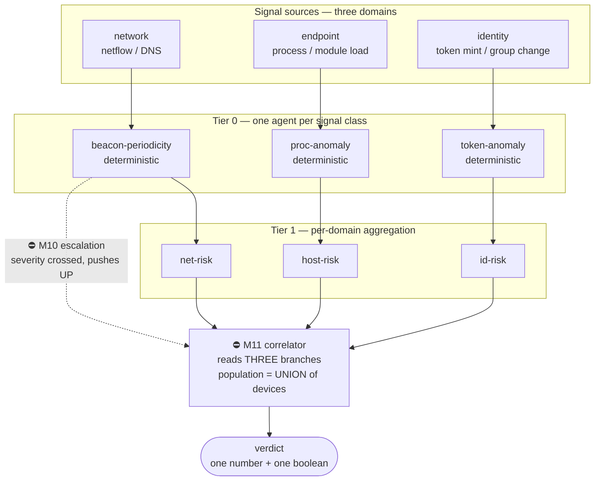

# Worked example — a cyber detection, end to end

The industrial example (temp / vibration / pressure) shows the **shape**. It
does not show the **hard part**, because a temperature sensor has no adversary
and its signals do not have to be combined across domains to mean anything.

This is the security worked example the external review asked for. ⚠ Two of the
capabilities it depends on — **event-driven escalation (M10)** and the
**correlation tier (M11)** — do not exist yet. They are marked ⛔ below. This
document is the target, and the honest statement of what is missing from it.

---

## The detection

> A workstation begins beaconing to a C2 host. Within minutes an unusual admin
> token is minted for the same user, and a lateral SMB connection opens to a
> file server. Individually each is noise. Together they are an incident.

That sentence is the requirement, and it is exactly what the current mesh
cannot express: nothing escalates on its own, and nothing may read across
branches.

---

## The tiers

Two edges carry the whole review in them:

- **The dotted edge** is M10. Today it does not exist, so `beacon-periodicity`
  cannot tell anyone anything until the synthesizer next asks. Beaconing is
  detected on the *next scheduled cascade*, not when it starts.
- **`X` reading three branches** is M11. Today
  `ctx.inputs.retain(|i| children.contains(&i.agent_id))` (`mesh.rs:257`)
  restricts every aggregator to its direct children, so `net-risk`, `host-risk`
  and `id-risk` can never meet.

---

## ⚠⚠ The arithmetic trap this example exposes

All three branches observe **the same workstation**. A correlator that summed
its inputs' `input_count` would count that host three times and inflate its own
confidence exactly when the signals agree — the worst possible moment to be
wrong, because agreement is what makes it an incident.

So M11's population is the **union of contributing device identities**, not the
sum of counts. That is why M11 changes the event model (aggregates must carry a
population *identity set*, not just a number) rather than merely relaxing a
filter.

The industrial example never surfaces this: temp and vibration agents own
*disjoint* devices, so sum and union coincide. **A worked example that cannot
exhibit the failure cannot justify the design** — which is precisely why this
one was needed.

---

## Why an LLM belongs at `X` and nowhere below it

`beacon-periodicity` is an interval-variance calculation. `token-anomaly` is a
comparison against a baseline. Neither wants a model, and putting one there
costs a call per device per append.

`X` is different: *"is this one incident or three coincidences?"* is a judgement
over heterogeneous evidence, it runs only on escalation, and there are four of
them. Low volume, high value — see §7.2 of the production plan.

---

## What has to be true before this runs

| need | milestone | state |
| :-- | :-- | :-- |
| tier-0 pushes upward on severity | **M10** | ⛔ not built |
| a role that reads multiple branches | **M11** | ⛔ not built |
| a missing branch degrades rather than skews | **M12** | ⛔ not built — today a silently smaller denominator |
| per-agent streams so 200 agents do not fold one log | M5 | mechanism yes, partitioning no |
| a model at the correlator | M4 | ⛔ not built |

⚠ Until M10 and M11 land, this page describes an intent. Nothing here should be
cited as a capability.
